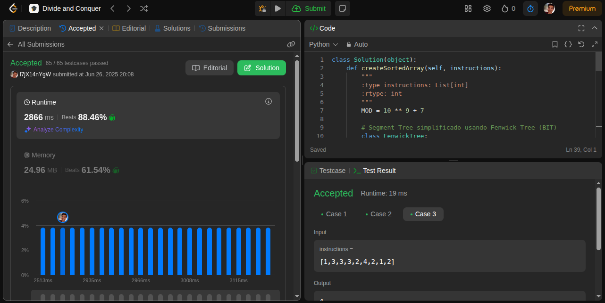
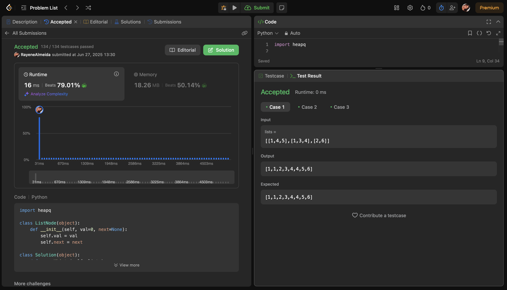

# Divide and Conquer

**Conteúdo da Disciplina**: Algoritmos de Dividir e Conquistar

## Alunos
|Matrícula | Aluno |
| -- | -- |
| 22/1022720  | Rayene Ferreira Almeida |
| 17/0108341 | Levi de Oliveira Queiroz |


## Sobre 
O objetivo deste repositório é conter as soluções de problemas nível médio e hard de programação do LeetCode. 


## Screenshots
### [1649. Create Sorted Array through Instructions](https://leetcode.com/problems/create-sorted-array-through-instructions/?envType=problem-list-v2&envId=divide-and-conquer)




### [3165. Maximum Sum of Subsequence With Non-adjacent Elements](https://leetcode.com/problems/maximum-sum-of-subsequence-with-non-adjacent-elements/description/?envType=problem-list-v2&envId=divide-and-conquer)


### [23. Merge k Sorted Lists](https://leetcode.com/problems/merge-k-sorted-lists/description/?envType=problem-list-v2&envId=divide-and-conquer)




### [218. The Skyline Problem](https://leetcode.com/problems/the-skyline-problem/description/?envType=problem-list-v2&envId=divide-and-conquer)


## Instalação 
**Linguagem**: Python<br>
1. Navegue até a pasta do problema desejado. Ex: `cd 3523`
2. Rode o algoritmo com o comando:

```
python3 solucao.py
```

## Uso 
Apenas execute o código

## Vídeo 

